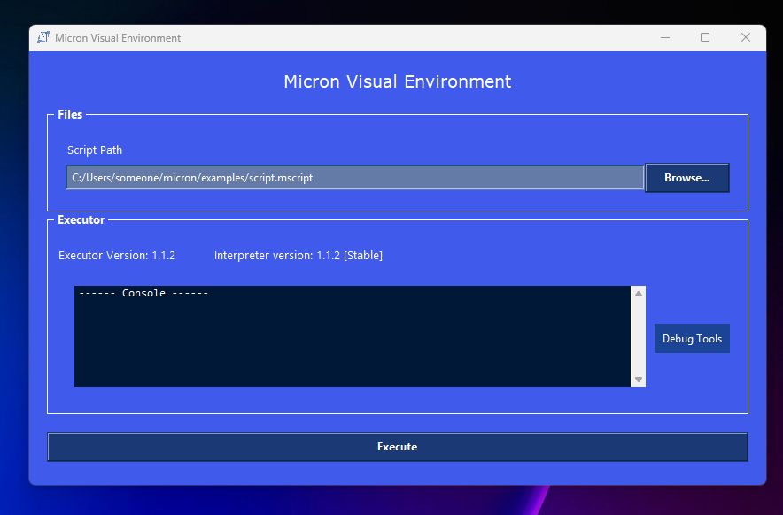

# README

## How to execute something

- <b>CMD</b>: Open PowerShell and enter this command to launch a file from the Windows console: <b>```.\micron2.0 [filepath]```</b>
## Code

Run the default functions in the interpreter by writing to a file or in the terminal (Recommended: It is better to use files since you can run long codes or test several functions at once):

- <b>```print(any)```</b>: Prints text or any type of value to the console
- <b>```printnon(any)```</b>: Prints any type of value or text to the console without a new line
- <b>```locals()```</b>: Print the dictionary of variables
- <b>```localsf()```</b>: Print the function position dictionary
- <b>```power(int,int,<out:variable>)```</b>: Elevate the first argument to the second
- <b>```input(str,<out:variable>)```</b>: It obtains the user's input into a variable.
- <b>```system(str)```</b>: Executes a command in the native Windows console
- <b>```manual()```</b>: Opens a basic manual covering all the basic functions
- <b>```version()```</b>: Displays the interpreter version on the
- <b>```clear()```</b>: Delete all text in the console

### Statements

They use variable syntax and are usually ended using simple words <u><b>(VARIABLES ARE 100% GLOBAL IF YOU DEFINE THEM IN A FUNCTION THEY ARE NOT LOCAL)</u></b>

 - <b>If</b> statement: They are defined using <b>```if:```</b> and then placing a condition. So far, only the operators ```=>```,```=<```,```=!``` and ```==``` are available with numbers and variables. Example:
 ```
 if: x == 0
 print('x is empty')
 print(x)
 endif
 ```
 - <b>Functions</b>: Functions can be defined using ```def:``` by placing their name and the operator ```=f```, then all the code that will be executed when the function is called. Example: 
  ```
 def: goodbye  =f
 print('goodbye!')
 exit()
 end
 ```
 - <b>Repeat</b>/<b>While</b> statement: They are defined using ```repeat:``` along with a condition, just like `if:```. The code inside the loop will be repeated until the condition is met. Example: 
 ```
 var: i = 0
 repeat: i == 5
 set: i = i+1
 print(i)
 endrepeat
 ```

### Variables

Variables are created and modified without using functions directly. Therefore, they are slightly different:

- <b>```var: [name] = [value]```</b>: Creates a variable with a base value
- <b>```set: [name] = [newvalue]```</b>: Modifies the value of a variable to a new one

Variables are stored in a dictionary, so technically and at the code level they look like this: {name:value}. These variables can be called by putting their name in the arguments of a function, for example: print(myvar). If they don't exist, an error will be thrown.

### Arithmetic function

The new arithmetic functions make performing operations within variables or functions easier; it works under the `math(arg)` function.

Before performing the entire process, the symbol `-` is replaced with `+-`. The system first performs the simplest operations using `.split()`. If the result, for example, is `['1','1*3']`, the program detects that the second object in the list is a multiplication, collects this data, and calculates it by adding a value to the list of values. The same is done with subtraction, using subtraction to find a division.

Finally, all the contents of the list of values ​​are added together, giving the final result.

## MVE: Micron Visual Environment 



With this tool, you can run Micron in a 100% visual environment outside of the terminal. This visual environment is easy to use and of high quality. This interface is built using `tkinter` and the following libraries: subprocess, os, time, and pathlib. `subprocess` creates the interpreter's base environment. `time` handles synchronization using `sync.tmp`, and `os` manages operating system-level functions.

The system runs the Micron kernel directly as a child program. During the creation of the child program, a file is allocated using the execution command to create the child program, and then the `debug` variable is assigned as an environment variable at runtime.

To "synchronize" the program or ensure it is responding, the Micron kernel creates a temporary file called `sync.tmp` in the `src\.tmp` folder. The MVE environment checks for the existence of this file; if it doesn't exist, it terminates the process.

After all this, MEV obtains the result from the Micron kernel and places it within the visual console, thus ending the execution cycle.

## Build 

Run [src/build.bat](src/build.bat). It will build an executable that you can use as the main interpreter and add to the <i>system variables</i> to use it directly in the console.

## Requirements

- <b>OS</b>: Windows
- <b>Python Version</b>: 3.12>
- <b>Libraries (All come pre-installed):</b>`os`,`pathlib`,`tkinter`,`subprocess`,`time`,`sys`

## Ideas and Contributions

You can modify the project as much as you like and feel free to comment with your ideas. I will be very active in making changes and reading your feedback.

- <b>Youtube</b>: @aprogrammer1024

## Miscellaneous

The current version of Micron is 1.1.2; sometimes this README will not be updated to the latest version.
